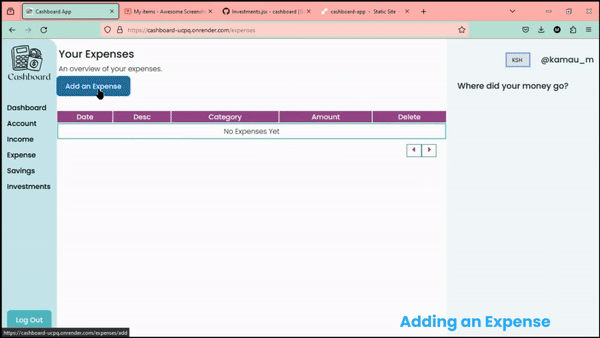

# Cashboard App
Cashboard is an application that helps users keep track of their income, expenses, savings and investments.

It is a personal finance tool that enables users to understand how they spend their money

## Demo and Video

[View Demo](https://cashboard-ucpq.onrender.com/)

[View Documentation](https://mitchsorg.mintlify.app/)

## App Features
- Authetication and Authorization

- Account Tracker

- Income Tracker

- Expense Tracker

- Savings Tracker

- Investment Tracker

## Tech Stack
- Node
- Express
- React
- Vanilla CSS
- MongoDB
- Mongoose
- Material UI Charts
- Postman - testing API endpoints
- Mintlify - documentation

## What I Learnt
1. How to encrypt a password
2. How to work with embedded documents in MongoDB [Check Out My Blog](https://mitchcodes.hashnode.dev/a-beginners-guide-to-subdocuments-in-mongoose)
3. How to implement ACID transaction in Mongoose [Check Out My Blog](https://mitchcodes.hashnode.dev/how-to-create-an-acid-transaction-in-mongoose)
4. How to implement pagination in React **[ Pending Blog ]**
5. How to use a chart from Material UI.
6. How to write documentation using Mintlify
7. How to convert a Postman Collection to an Open API Specification

## Future Improvements
- [ ] blocking out future dates
- [ ] automated income ( Income is automatically added after a specified period of time )
- [ ] automated expense ( monthly, weekly, yearly )
- [ ] report generation
- [ ] report download
- [ ] detailed analytics
